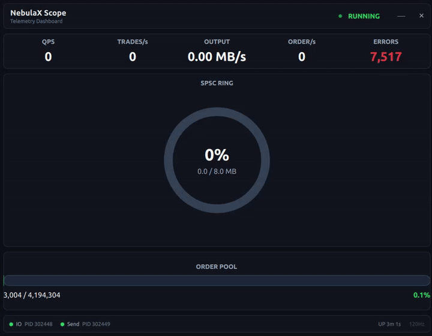

# NebulaX-Scope

[](https://www.qt.io)
[](https://isocpp.org)
[](LICENSE)
[](https://kernel.org)

**高性能交易系统的共享内存实时监控仪表盘。**

<p align="center">
  
</p>

NebulaX-Scope 是一个独立监控进程，通过 `mmap` 只读方式读取 [NebulaX](https://github.com/user/NebulaX) 撮合引擎的共享内存指标，通过 Qt6 QML GPU 加速界面实时可视化。

> **零侵入**。不需要修改被监控服务的代码，不需要 Agent，不需要 IPC，没有网络开销。
> 只读取 152 字节共享内存，其余指标全部派生计算。

---

## 架构

```
 ┌─────────────────────────────────────────────────────────────┐
 │                    NebulaX (C++ 撮合引擎)                     │
 │  写 /dev/shm/nebulaX_metrics  (128 B, 16 × uint64_t)       │
 │        /dev/shm/nebulaX_ring   ( 24 B,  3 × uint64_t)      │
 └────────────────────┬────────────────────────────────────────┘
                      │ mmap (只读)
                      ▼
 ┌─────────────────────────────────────────────────────────────┐
 │  SharedMemoryMonitor (QObject, QML 单例)                    │
 │  ┌───────────────────────────────────────────────────────┐  │
 │  │ QTimer 8ms (120Hz) → poll() → emit 信号体系          │  │
 │  │   ├── ringUpdated()   →  RingTelemetry (Canvas 圆环)  │  │
 │  │   ├── poolUpdated()   →  OrderPoolBar (进度条)        │  │
 │  │   └── updated()       →  MetricCard (文字, 4Hz)       │  │
 │  └───────────────────────────────────────────────────────┘  │
 └────────────────────┬────────────────────────────────────────┘
                      │ QML 声明式绑定 (GPU 场景图)
                      ▼
 ┌─────────────────────────────────────────────────────────────┐
 │  ScopeWindow.qml (无边框窗口)                                │
 │  ├── MetricCard.qml     (平滑数字动画)                       │
 │  ├── RingTelemetry.qml  (Canvas 圆环 + 呼吸光晕)              │
 │  ├── OrderPoolBar.qml   (进度条 + 流光)                     │
 │  └── 状态栏             (线程存活, PID, 运行时间)             │
 └─────────────────────────────────────────────────────────────┘
```

### 关键设计决策

| 决策 | 原因 |
|------|------|
| **共享内存** vs TCP/UDP | 零拷贝，无上下文切换，~50ns 延迟 |
| **只 mmap 152 字节**（不读 340MB 订单簿） | 避免触发巨量缺页中断 |
| **C++ 后端 + QML 前端** | Qt6 声明式绑定省掉胶水代码 |
| **3 路独立更新信号** | Ring(120Hz) / Pool(120Hz) / 文字(4Hz) — 不浪费重绘 |
| **Canvas 2D** vs Qt Charts / Shapes | Qt 6.2 Shapes 的 sweepAngle 有 bug；Canvas 可靠且经过充分测试 |
| **自动重连** | NebulaX 重启后每 2s 自动重连，无需手动重新启动 |

---

## 共享内存布局

### `/dev/shm/nebulaX_metrics` — 128 字节

| 偏移 | 字段 | 写入者 | 说明 |
|------|------|--------|------|
| 0 | `io_thread_pid` | main | IO 线程 PID（启动时设一次）|
| 1 | `send_thread_pid` | main | Send 线程 PID |
| 2 | `recv_frames` | IO | 已完成的 recv CQE 数 |
| 3 | `new_orders` | IO | 新订单数 |
| 4 | `cancels` | IO | 撤单数 |
| 5 | `book_queries` | IO | 行情查询数 |
| 6 | `trades` | IO | 成交笔数 |
| 7 | `errors` | IO | 错误数 |
| 8 | `order_pool_used` | IO | 订单池当前活单数 |
| 9 | `order_pool_capacity` | IO | 订单池总容量（固定 4M）|
| 10 | `tick_counter` | IO | 每次 IO 循环 +1 |
| 11 | `send_batches` | Send | 发送批次数 |
| 12 | `send_bytes` | Send | 发送总字节数 |
| 13 | `send_zc_ok` | Send | 零拷贝发送成功数 |
| 14 | `send_zc_fail` | Send | 零拷贝失败回落数 |
| 15 | `send_tick_counter` | Send | 每次 Send 循环 +1 |

```python
import mmap, os, struct
fd = os.open("/dev/shm/nebulaX_metrics", os.O_RDONLY)
mm = mmap.mmap(fd, 128, mmap.MAP_SHARED, mmap.PROT_READ)
io_pid, send_pid, _, orders, *_ = struct.unpack_from("<16Q", mm, 0)
```

### `/dev/shm/nebulaX_ring` — 24 字节

| 偏移 | 字段 | 说明 |
|------|------|------|
| 0 | `tail` | IO 线程写入位置（环内偏移 0..capacity）|
| 1 | `head` | Send 线程读取位置 |
| 2 | `capacity` | 环总容量（固定 8MB）|

派生：`used = tail - head`（模 capacity），`利用率 = used / capacity`

---

## 构建与运行

### 依赖

```bash
sudo apt install qt6-base-dev qt6-declarative-dev
```

### 构建

```bash
cd NebulaX-Scope
rm -rf build && mkdir build && cd build
cmake .. && make -j$(nproc)
```

### 运行

1. 先启动 NebulaX：

```bash
taskset -c 6,7 /path/to/nebulaX 2250 --io-core 6 --send-core 7 &
```

2. 启动 Scope：

```bash
./build/scope
```

仪表盘自动连接共享内存并显示实时指标。NebulaX 重启后会自动重连。

---

## QML 后端 API 参考

C++ 类 `SharedMemoryMonitor` 注册为 QML 单例 `Monitor`（模块 `NebulaX.Scope`）。

```qml
import NebulaX.Scope 1.0

Text { text: Monitor.qps }            // 实时 QPS
Text { text: Monitor.ioAlive }        // IO 线程健康状态
```

### 属性

| 属性 | 类型 | 信号 | 频率 | 说明 |
|------|------|------|------|------|
| `qps` | double | `updated` | 4Hz | 每秒订单数 |
| `orderRate` | double | `updated` | 4Hz | 新订单速率 |
| `tradeRate` | double | `updated` | 4Hz | 成交速率 |
| `sendThroughput` | double | `updated` | 4Hz | 发送吞吐量 (bytes/s) |
| `zcRate` | double | `updated` | 4Hz | 零拷贝成功率 |
| `totalOrders` | uint64 | `updated` | 4Hz | 累计订单数 |
| `totalTrades` | uint64 | `updated` | 4Hz | 累计成交数 |
| `errors` | uint64 | `updated` | 4Hz | 错误数 |
| `ioAlive` | bool | `updated` | 4Hz | IO 线程存活 |
| `sendAlive` | bool | `updated` | 4Hz | Send 线程存活 |
| `ioPid` | uint64 | `updated` | 4Hz | IO 线程 PID |
| `sendPid` | uint64 | `updated` | 4Hz | Send 线程 PID |
| `uptimeSeconds` | int | `updated` | 4Hz | 运行时长 |
| `poolUtilization` | double | `poolUpdated` | 120Hz | 订单池占用比 |
| `orderPoolUsed` | uint64 | `poolUpdated` | 120Hz | 池中活单数 |
| `orderPoolCapacity` | uint64 | `poolUpdated` | 120Hz | 池总容量 (4,194,304) |
| `ringReadPtr` | uint64 | `ringUpdated` | 120Hz | 环尾指针（IO 写入位置）|
| `ringWritePtr` | uint64 | `ringUpdated` | 120Hz | 环头指针（Send 读取位置）|
| `ringUsedBytes` | uint64 | `ringUpdated` | 120Hz | 环已用字节数 |
| `ringCapacity` | uint64 | `ringUpdated` | 120Hz | 环总容量 (8,388,608) |
| `ringUtilization` | double | `ringUpdated` | 120Hz | 环占用比 |
| `connected` | bool | `connectedChanged` | 事件 | 共享内存是否可达 |

### 信号

```qml
Monitor.updated()            // 文字指标刷新
Monitor.poolUpdated()        // 池进度条刷新
Monitor.ringUpdated()        // 环 Canvas 刷新
Monitor.connectedChanged()   // 连接状态变化
```

---

## 脚本

| 脚本 | 用途 |
|------|------|
| [`buy.py`](scripts/buy.py) | 指定价格发 N 笔 BUY 订单 |
| [`sell.py`](scripts/sell.py) | 指定价格发 N 笔 SELL 订单 |
| [`bench_backpressure.py`](scripts/bench_backpressure.py) | 持续环压力测试，自适应反压控制 |
| [`test_read_shm.cpp`](scripts/test_read_shm.cpp) | 最小 C++ 共享内存读取示例（无 Qt）|

---

## 派生指标

| 指标 | 公式 | 数据源 |
|------|------|--------|
| QPS | `Δorders / Δt` | `new_orders` |
| 成交率 | `Δtrades / Δt` | `trades` |
| 发送吞吐 | `Δbytes / Δt` | `send_bytes` |
| ZC 成功率 | `zc_ok / (zc_ok + zc_fail)` | `send_zc_ok/fail` |
| 池利用率 | `pool_used / pool_capacity` | `order_pool_used/capacity` |
| 环利用率 | `used / capacity` | `tail, head` |
| IO 存活 | 3 秒内 `tick_counter` 是否递增 | `tick_counter` |
| Send 存活 | 3 秒内 `send_tick_counter` 是否递增 | `send_tick_counter` |

---

## 项目结构

```
NebulaX-Scope/
├── CMakeLists.txt                # qt_add_qml_module 声明式构建
├── README.md
├── qml/
│   ├── ScopeWindow.qml           # 主窗口（无边框、圆角）
│   ├── MetricCard.qml            # 指标卡片（平滑数字动画）
│   ├── RingTelemetry.qml         # Canvas 圆环（呼吸光晕）
│   └── OrderPoolBar.qml          # 进度条（流光效果）
├── src/
│   ├── main.cpp                  # 入口、单例注册
│   ├── SharedMemoryMonitor.h     # 22 个 Q_PROPERTY 声明
│   └── SharedMemoryMonitor.cpp   # mmap、轮询、重连逻辑
└── scripts/
    ├── buy.py                    # 发单工具
    ├── sell.py                   # 发单工具
    ├── bench_backpressure.py     # 环压力测试
    └── test_read_shm.cpp         # 独立共享内存读取示例（无 Qt）
```

---

## 为什么不用…？

**Qt Charts？** 避免额外依赖。Canvas 在 Qt6 `rhi` 后端下同样通过 GPU 场景图加速，且渲染完全可控。

**Web 面板？** Web 前端（Grafana 等）需要暴露 HTTP 接口，增加延迟和攻击面。共享内存 mmap 是到数据的最低开销路径。

**Widgets？** QML 的声明式绑定（`Q_PROPERTY ... NOTIFY`）省掉了胶水代码。同样功能用 Widgets 需要 3 倍以上的 C++ 代码来手动 `setText()` 和定时器管理。

---

## 许可证

MIT
